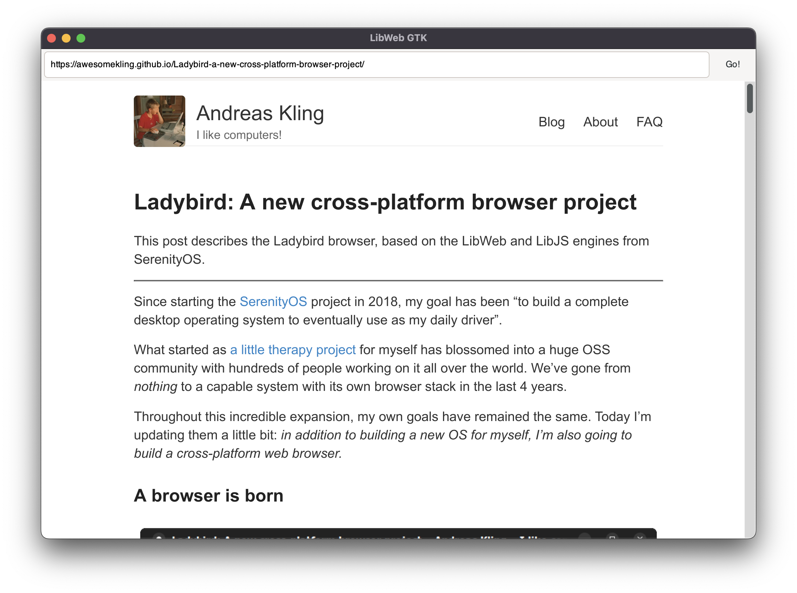

# LibWeb for GTK
LibWeb is the SerenityOS Browser Engine that powers the ladybird browser.

It's a new, independent, and portable browser engine that is making incredible progress.

LibWebGTK is akin to WebKitGTK in that it wraps LibWeb for embedding inside GTK based applications.



## Status
This is not production ready so use at your own risk.

## Contributing
Interested in contributing? Start a discussion and let's get in touch!

## Building
Clone the repo and check out submodules
```
git clone ...
git submodule update --init --recursive
```

### Command Line
Make a new directory `Build` in the repository root.

From inside that directory, run:

```
cmake .. -GNinja
ninja run demo-browser
```

### CLion Setup
Open the project in CLion and load the CMake file in the repository root.

Find the run configuration named `run`, edit it, set `demo-browser` as the executable.

You are now ready to build and run `libweb-gtk`.

### macOS
On macOS, you will also need `icu4c` in your path. Set the following environment variable

```
# Intel
PKG_CONFIG_PATH="/usr/local/opt/icu4c/lib/pkgconfig"

# M1
PKG_CONFIG_PATH="/opt/homebrew/opt/icu4c/lib/pkgconfig"
```

You can do this in your CMake profile in CLion, or as part of your `.zshrc`.

See: https://www.jetbrains.com/help/clion/cmake-profile.html#EnvVariables

#### Debugging
On macOS, there is no gdb. Instead, use `ninja debug-lldb`.

## Licence
Available under the same licence as SerenityOS (BSD 2-Clause).